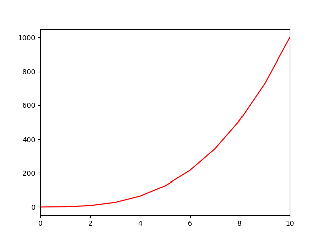
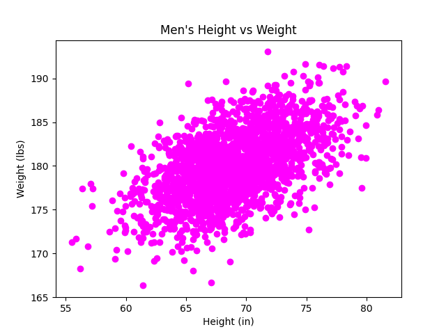
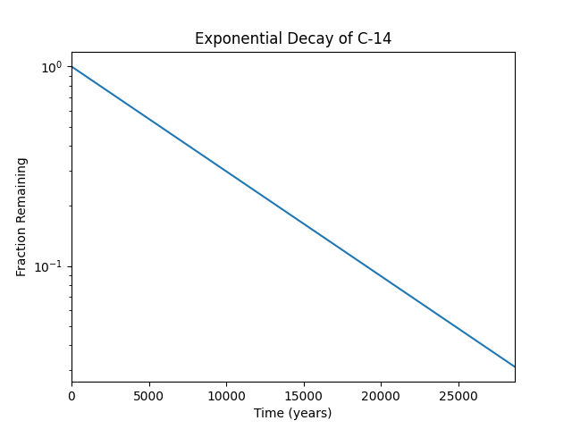

# Plotting

## Tasks

A ``UserWarning`` might be displayed during the executions below, as the ``Python`` programs utilising ``Matplotlib`` are being run within a headless environment — a ``Docker`` container or a server entirely lacking graphical display capabilities. Even so, the images of the plots will still be generated and saved successfully.

### 0. Line Graph

Complete the source code to plot `y` as a line graph:

- `y` should be plotted as a solid red line
- The x-axis should range from 0 to 10

#### Execution
In this case I am using a docker container 
```
root@6b792e227861:~/holbertonschool-machine_learning/math/1-plotting# python 0-line.py 
Authorization required, but no authorization protocol specified

/root/holbertonschool-machine_learning/math/1-plotting/0-line.py:21: UserWarning: FigureCanvasAgg is non-interactive, and thus cannot be shown
  plt.show()                # Show the plot
root@6b792e227861:~/holbertonschool-machine_learning/math/1-plotting# 
```




### 1. Scatter
Complete the source code to plot `x ↦ y` as a scatter plot:
- The x-axis should be labeled `Height (in)`
- The y-axis should be labeled `Weight (lbs)`
- The title should be `Men's Height vs Weight`
- The data should be plotted as magenta points

#### Execution
```
root@6b792e227861:~/holbertonschool-machine_learning/math/1-plotting# python 1-scatter.py 
Authorization required, but no authorization protocol specified

/root/holbertonschool-machine_learning/math/1-plotting/1-scatter.py:39: UserWarning: FigureCanvasAgg is non-interactive, and thus cannot be shown
  plt.show()                          # Display the plot
root@6b792e227861:~/holbertonschool-machine_learning/math/1-plotting#
```




### 2. Change of scale
Complete the source code to plot `x ↦ y` as a line graph:
- The x-axis should be labeled `Time (years)`
- The y-axis should be labeled `Fraction Remaining`
- The title should be `Exponential Decay of C-14`
- The y-axis should be logarithmically scaled
- The x-axis should range from 0 to 28650

#### Execution

```
root@6b792e227861:~/holbertonschool-machine_learning/math/1-plotting# python 2-change_scale.py 
Authorization required, but no authorization protocol specified

/root/holbertonschool-machine_learning/math/1-plotting/2-change_scale.py:29: UserWarning: FigureCanvasAgg is non-interactive, and thus cannot be shown
  plt.show()
root@6b792e227861:~/holbertonschool-machine_learning/math/1-plotting# 
```




### 3. Two is better than one
Complete the following source code to plot `x ↦ y1` and `x ↦ y2` as line graphs:
- The x-axis should be labeled `Time (years)`
- The y-axis should be labeled `Fraction Remaining`
- The title should be `Exponential Decay of Radioactive Elements`
- The x-axis should range from 0 to 20,000
- The y-axis should range from 0 to 1
- `x ↦ y1` should be plotted with a dashed red line
- `x ↦ y2` should be plotted with a solid green line
- A legend labeling `x ↦ y1` as `C-14` and `x ↦ y2` as `Ra-226` should be placed in the upper right hand corner of the plot

### 4. Frequency:
Complete the following source code to plot a histogram of student scores for a project:
- The x-axis should be labeled `Grades`
- The y-axis should be labeled `Number of Students`
- The x-axis should have bins every 10 units
- The title should be `Project A`
- The bars should be outlined in black

### 5. All in One:
Complete the following source code to plot all 5 previous graphs in one figure:
- All axis labels and plot titles should have a font size of `x-small` (to fit nicely in one figure)
- The plots should make a 3 x 2 grid
- The last plot should take up two column widths (see below)
- The title of the figure should be `All in One`

### 6. Stacking Bars:
Complete the following source code to plot a stacked bar graph:
* `fruit` is a matrix representing the number of fruit various people possess
 * The columns of `fruit` represent the number of fruit `Farrah`, `Fred`, and `Felicia` have, respectively
 * The rows of `fruit` represent the number of `apples`, `bananas`, `oranges`, and `peaches`, respectively
* The bars should represent the number of fruit each person possesses:
 * The bars should be grouped by person, i.e, the horizontal axis should have one labeled tick per person
 * Each fruit should be represented by a specific color:
  * `apples` = red
  * `bananas` = yellow
  * `oranges` = orange (`#ff8000`)
  * `peaches` = peach (`#ffe5b4`)
  * A legend should be used to indicate which fruit is represented by each color
 * The bars should be stacked in the same order as the rows of `fruit`, from bottom to top
 * The bars should have a width of` 0.5`
* The y-axis should be labeled `Quantity of Fruit`
* The y-axis should range from 0 to 80 with ticks every 10 units
* The title should be `Number of Fruit per Person`

